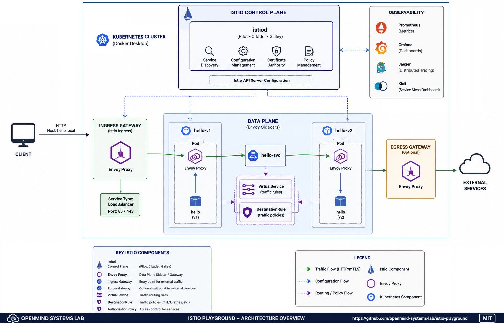

<p align="center">
  
</p>

<h1 align="center">Istio Playground</h1>

<p align="center">
A hands-on Istio Proof of Concept for Kubernetes (Docker Desktop)
</p>

<p align="center">


</p>


# 🚀 Overview

This repository demonstrates the core capabilities of Istio on a local
Kubernetes cluster using Docker Desktop.

Features:

-   Traffic management
-   Traffic splitting
-   Automatic sidecar injection
-   Mutual TLS (mTLS)
-   AuthorizationPolicy
-   Istio Ingress Gateway
-   Helm-based installation
-   Kubernetes-native configuration

# 🏗️ Architecture



Istio control plane and data plane architecture deployed on Kubernetes.

# 📦 Components

### Control Plane

-   istiod

### Data Plane

-   Istio Ingress Gateway (Envoy)
-   Envoy Sidecar Proxy

### Sample Applications

-   hello-v1
-   hello-v2

### Istio Resources

-   Gateway
-   VirtualService
-   DestinationRule
-   PeerAuthentication
-   AuthorizationPolicy

# 🎯 Objective

Learn how Istio manages traffic, security and service-to-service communication without manually configuring Envoy.

# 🤔 Why use Istio instead of Envoy directly?

Envoy is a high-performance Layer 7 proxy.

By itself, Envoy does not provide a centralized management plane. Every Envoy instance must be configured individually using xDS APIs. Routing rules, certificates, retries, authorization and other policies must all be maintained manually.

Istio builds a complete control plane on top of Envoy and exposes Kubernetes-native APIs for traffic management and security.

| Envoy | Istio |
|------------|-------------|
|  High-performance proxy   |       Service mesh platform|
|  Manual xDS configuration |       Kubernetes-native CRDs |
|  Manual traffic routing     |     VirtualService |
|  Manual certificate management |  Automatic mTLS |
|  Manual authorization          | AuthorizationPolicy |
|  Individual proxy management   |  Centralized control plane |


In short:

-   **Envoy is the data plane.**
-   **Istio is the control plane.**

# 📋 Prerequisites

-   Docker Desktop Kubernetes enabled
-   kubectl
-   Helm

# ⚙️ Installation

``` bash
helm repo add istio https://istio-release.storage.googleapis.com/charts
helm repo update

helm install istio-base istio/base -n istio-system --create-namespace
helm install istiod istio/istiod -n istio-system --wait
helm install istio-ingress istio/gateway -n istio-system --wait

kubectl create namespace istio-playground
kubectl label namespace istio-playground istio-injection=enabled
```

# 🚀 Deployment

``` bash
kubectl apply -f manifests/
```

# ✅ Verification

``` bash
kubectl get pods -n istio-playground
kubectl get gateway,virtualservice,destinationrule -n istio-playground
```

# 🧪 Testing

## ⚖️ Test 1 --- 80/20 Traffic Split

The default VirtualService routes:

-   v1 → 80%
-   v2 → 20%

``` bash
for i in {1..50}; do
  curl -s -H "Host: hello.local" http://localhost:8080
done | sort | uniq -c
```

Expected output (approximately):

``` text
40 Hello from Istio playground v1
10 Hello from Istio playground v2
```

## 🔄 Test 2 --- Update to 50/50

``` bash
kubectl patch virtualservice hello \
-n istio-playground \
--type='json' \
-p='[
{"op":"replace","path":"/spec/http/0/route/0/weight","value":50},
{"op":"replace","path":"/spec/http/0/route/1/weight","value":50}
]'
```

Run the test again:

``` bash
for i in {1..50}; do
  curl -s -H "Host: hello.local" http://localhost:8080
done | sort | uniq -c
```

Expected:

``` text
25 Hello from Istio playground v1
25 Hello from Istio playground v2
```

> The distribution is probabilistic. Increasing the number of requests
> produces results closer to the configured weights.

# 🔐 mTLS Verification

``` bash
kubectl get peerauthentication -n istio-playground
```

# 🛡️ AuthorizationPolicy Verification

``` bash
kubectl get authorizationpolicy -n istio-playground
```

# 🧹 Cleanup

``` bash
kubectl delete namespace istio-playground

helm uninstall istio-ingress -n istio-system
helm uninstall istiod -n istio-system
helm uninstall istio-base -n istio-system
```

# 📚 References

-   https://istio.io/latest/docs/
-   https://istio.io/latest/docs/concepts/traffic-management/
-   https://istio.io/latest/docs/concepts/security/

# 🏛 About OpenMind Systems Lab

OpenMind Systems Lab is an independent French non-profit association dedicated to research, experimental development and technical benchmarking in Cloud Native technologies.

Our mission is to produce practical, reproducible and educational Open Source Proofs of Concept covering Kubernetes, Platform Engineering, Distributed Messaging, Infrastructure Security and Artificial Intelligence.

GitHub Organization:

https://github.com/openmind-systems-lab


---

<p align="center">
Made with ❤️ by OpenMind Systems Lab
</p>
